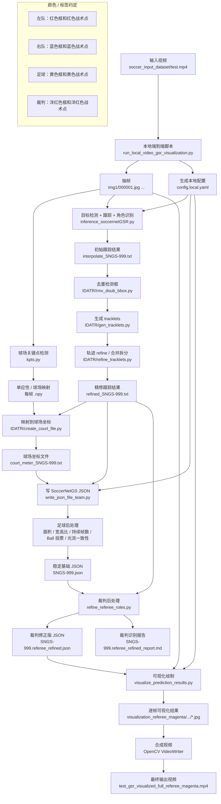
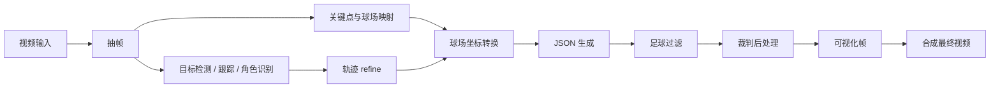

# SoccerNetGSR Local Pipeline Flowchart

下面的 Mermaid 流程图描述当前本地项目从普通足球视频输入，到最终带检测框和右上角战术图的视频输出的完整流程。

## PNG 图片版

## Mermaid 可编辑版

## 简化流程

## 主要输入输出文件

| 阶段 | 关键文件 | 作用 |
| --- | --- | --- |
| 输入 | `soccer_input_dataset/test.mp4` | 原始足球视频 |
| 本地适配 | `run_local_video_gsr_visualization.py` | 组织数据目录并串联全流程 |
| 抽帧结果 | `soccer_input_dataset/gsr_demo/SoccerNetGS/test/SNGS-999/img1/` | 后续模型逐帧处理的输入 |
| 跟踪结果 | `interpolate_SNGS-999.txt`、`refined_SNGS-999.txt` | 图像坐标中的目标轨迹 |
| 球场坐标 | `court_meter_SNGS-999.txt` | 目标在球场平面上的坐标 |
| 稳定基础结果 | `SNGS-999.json` | 足球光流过滤后的基础 JSON |
| 裁判修正结果 | `SNGS-999.referee_refined.json` | 裁判从两队中分离后的最终 JSON |
| 最终视频 | `test_gsr_visualized_full_referee_magenta.mp4` | 当前推荐可视化输出 |
